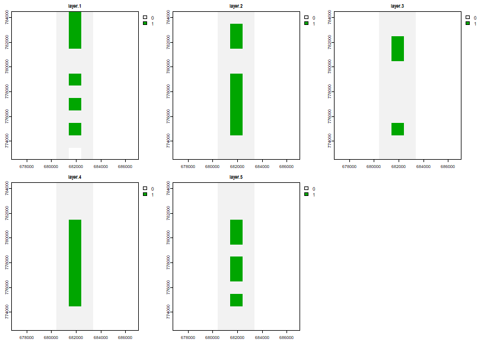
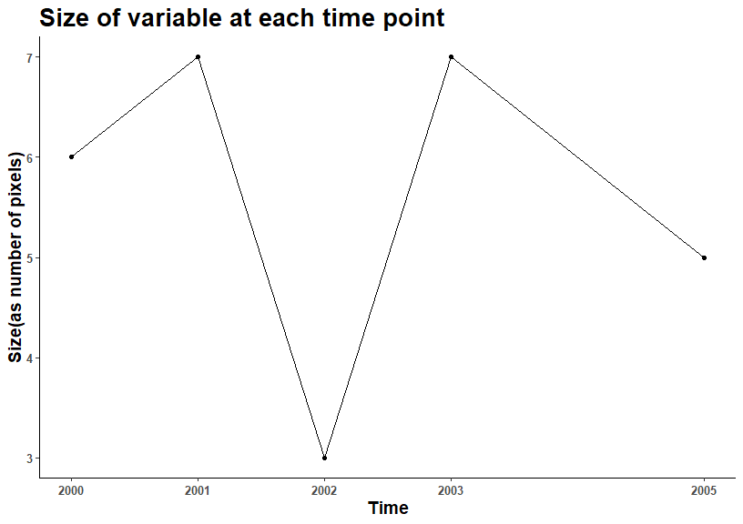
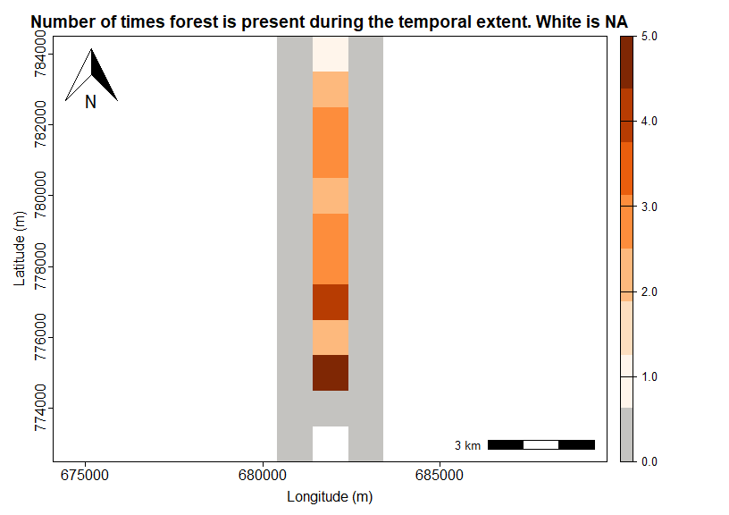
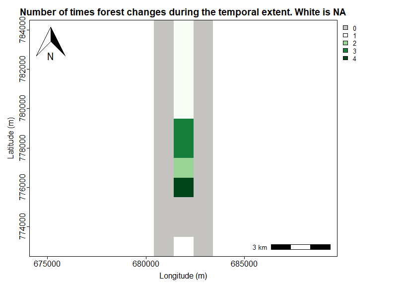
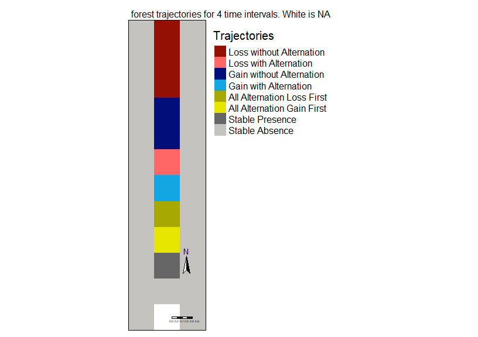
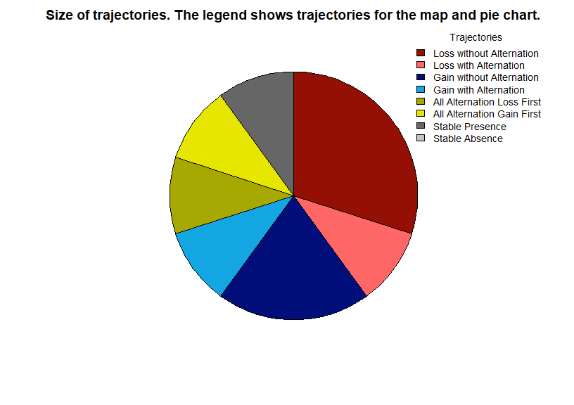
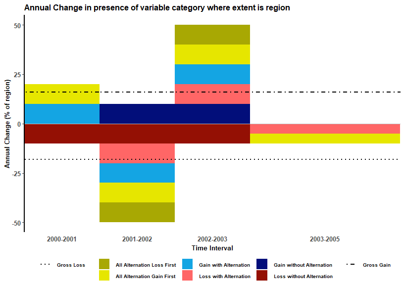
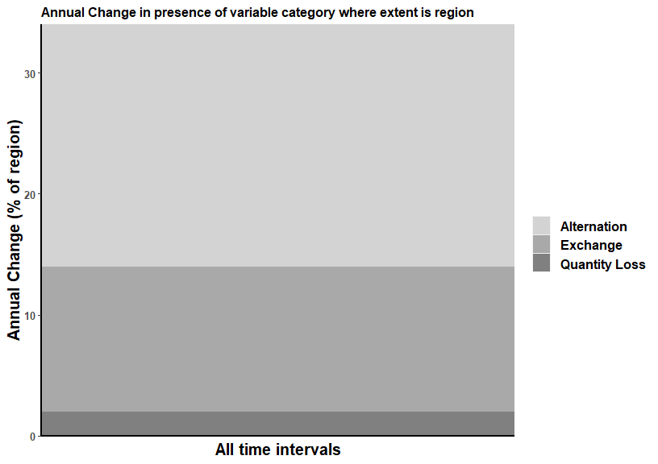

timeseriesTrajectories
================
Thomas Mumuni Bilintoh
2024-01-03

## Data

The example data is a time series of five binary maps at five time
points: 2000, 2001, 2002, 2003, and 2005. The tutorial analyzes the
trajectory of variable 1, which in this instance indicates presence,
whiles 0 represents absence.

The time series maps are available in GeoTIFF formats and included in
the package. The first step is to load the raster files.

``` r
# Read the raster files from "externa"l folder as terra raster format.
#NB: The package comes with "Example_Data_Y.tif" and "Continuous_Data.tif".
#This tutorial shows results for only Example_Data_Y.tif.

rasstackY <- terra::rast(system.file("external/binary_raster_stack.tif",package="timeseriesTrajectories"))
rasstackY
#> class       : SpatRaster 
#> dimensions  : 12, 3, 5  (nrow, ncol, nlyr)
#> resolution  : 1000, 1000  (x, y)
#> extent      : 680400, 683400, 772500, 784500  (xmin, xmax, ymin, ymax)
#> coord. ref. : WGS 84 / UTM zone 32N (EPSG:32632) 
#> source      : binary_raster_stack.tif 
#> names       : layer.1, layer.2, layer.3, layer.4, layer.5 
#> min values  :       0,       0,       0,       0,       0 
#> max values  :       1,       1,       1,       1,       1

# Visualize the raster data
plot(rasstackY)
```

<!-- -->

## Calling the `dataClean` function

Next, use the **dataClean** function to reclassify your data if
necessary. The functions build upon terra’s **classify** function; thus,
see terra’s **classify** function for more information about creating
the reclassification range. I will reclassify the raster stack, so that
all 0s become 1s and 1s become 2s. to a binary raster stack to
illustrate the functionality of the **dataClean** function.Type
“?dataClean” in your R console to see the help file.

``` r
# create a data frame for your range of values
reclass_df <- cbind(from = c(1), 
                    to = c(2), 
                    becomes = c(2))

#Use terra's **classify** function to reclassify the raster stacked based on your reclassification data frame.
# Setting "include.lowest = TRUE" ensures that the lower limit of the range is included in the values to be reclassified.
#  see terra's **classify** function for more information.
rasstackY_v2 <- classify(rasstackY,reclass_df,include.lowest = TRUE)

# Visualize the reclassified raster data
plot(rasstackY_v2)
```

<!-- -->

## Calling the `dataPreview` function

The **dataPreview** function generates a time series graph for the
variable where the vertical axis is the size of the variable, and the
horizontal axis is time. Type “?dataPreview” in your R console to see
the help file.

``` r
# Create a vector for the time points.
tps = c(2000,2001,2002,2003,2005)

# I know the units of my varibel is number of pixels, thus I will create a sting for the vertical units.
vert_units <- "number of pixels"

# Next, pass the variables to the dataPreview function.
# NB: xAngle sets the orientation of the horizontal axis labels. See help file for more details.
dataPreview(rasstackY,
            timepoints = tps,
            vertunits = vert_units,
            xAngle = 0)
```

<!-- -->

## Calling the `presenceData` function

The **presenceData** function creates data for the variable’s number of
presence and change. Type “?presenceData” in your R console to see the
help file. Output from the **presenceData** function serves as input
data for the **presencePlot** function.

``` r
# The function takes tw parameters: a raster stack and the value to flag as NA the default is -999
# Let's create the data for the rasstackY data
num_pres_change <- presenceData(rasstackY, nodata = -999)

# Let's take a look.
num_pres_change
#> $`Data for number of presence`
#> class       : SpatRaster 
#> dimensions  : 12, 3, 1  (nrow, ncol, nlyr)
#> resolution  : 1000, 1000  (x, y)
#> extent      : 680400, 683400, 772500, 784500  (xmin, xmax, ymin, ymax)
#> coord. ref. : WGS 84 / UTM zone 32N (EPSG:32632) 
#> source(s)   : memory
#> name        : sum 
#> min value   :   0 
#> max value   :   5 
#> 
#> $`Data for unique number of presence`
#>   sum
#> 1   0
#> 2   1
#> 3   2
#> 4   3
#> 5   4
#> 6   5
#> 
#> $`Data for number of changes`
#> class       : SpatRaster 
#> dimensions  : 12, 3, 1  (nrow, ncol, nlyr)
#> resolution  : 1000, 1000  (x, y)
#> extent      : 680400, 683400, 772500, 784500  (xmin, xmax, ymin, ymax)
#> coord. ref. : WGS 84 / UTM zone 32N (EPSG:32632) 
#> source(s)   : memory
#> name        : sum 
#> min value   :   0 
#> max value   :   4 
#> 
#> $`Data for unique number of changes`
#>   sum
#> 1   0
#> 2   1
#> 3   2
#> 4   3
#> 5   4
```

The **presencePlot** function creates a map of the number of presence
and changes for the variable of interest. Type “?presencePlot” in your R
console to see the help file. Bilintoh, Thomas Mumuni, and Robert G
Jr. Pontius. “Methods to Compare Sites Concerning a Category’s Change
During Various Time Intervals.” forthcoming. provide more information
about the eight types of trajectories and the concept of the unified
size

``` r
# Let's pass thenum_pres_change we created to the presencePlot function.
# 4326
presencePlot(num_pres_change,
             pltunit = "m",
             dataEpsg = 32632,
             scalePos = "bottomright",
             narrowPos = "topleft",
             narrowSize = 1,
             categoryName = "forest",
             xAxis = "Longitude (m)",
             yAxis = "Latitude (m)",
             axisText = 1,
             axisLabel = 1,
             plotTitle = 1.2)
#> Loading required namespace: sp
#> Loading required namespace: rgdal
```

<!-- --><!-- -->

The **rastertrajData** function creates the data which serves as input
for the **trajPlot** function. The output data comprises a raster map,
pie chart, and corresponding attribute information such as colors and
size. Type “?rastertrajData” in your R console to see the help file.

``` r
# Let's cteae trajectory data foe the rasstackY data.
# zeroabsence is a string of "yes" or "no" indicating if 0 means absence. The default is "yes".
# unified is a string of "yes" or "no" indicating if the analysis involves the unified size. 
# The unified size is the union of the locations where the category exists at any time point. The default is "yes"
# user_spatial is an integer for the user-defined spatial extent. Default is 0.
# Type "?presencePlot"  in your R console to see the help file that describes all the parameters in the function.
traj_data <- rastertrajData(rasstackY,
                            zeroabsence = 'yes',
                            unified = "yes",
                            user_spatial = 0)
#>   |                                                          |                                                  |   0%  |                                                          |==================================================| 100%
# Let's take a look.
traj_data
#> $`Raster data for trajectory plot`
#> class       : SpatRaster 
#> dimensions  : 12, 3, 1  (nrow, ncol, nlyr)
#> resolution  : 1000, 1000  (x, y)
#> extent      : 680400, 683400, 772500, 784500  (xmin, xmax, ymin, ymax)
#> coord. ref. : WGS 84 / UTM zone 32N (EPSG:32632) 
#> source(s)   : memory
#> name        : change 
#> min value   :      1 
#> max value   :      8 
#> 
#> $`Attribute data for trajectory plot`
#>   ID   myCol                         cl
#> 1  1 #941004   Loss without Alternation
#> 2  2 #FF6666      Loss with Alternation
#> 3  3 #020e7a   Gain without Alternation
#> 4  4 #14a5e3      Gain with Alternation
#> 5  5 #a8a803 All Alternation Loss First
#> 6  6 #E6E600 All Alternation Gain First
#> 7  7 #666666            Stable Presence
#> 8  8 #c4c3c0             Stable Absence
#> 
#> $`Data for trajectory pie chart`
#>   ID myCol.x                       cl.x value
#> 1  1 #941004   Loss without Alternation     3
#> 2  2 #FF6666      Loss with Alternation     1
#> 3  3 #020e7a   Gain without Alternation     2
#> 4  4 #14a5e3      Gain with Alternation     1
#> 5  5 #a8a803 All Alternation Loss First     1
#> 6  6 #E6E600 All Alternation Gain First     1
#> 7  7 #666666            Stable Presence     1
#> 8  8 #c4c3c0             Stable Absence     0
#> 
#> $`Number of time points`
#> [1] 5
```

The **trajPlot** function creates the data which serves as input for the
**trajPlot** function. The output data comprises a raster map, pie
chart, and corresponding attribute information such as colors and size.
Type “?rastertrajData” in your R console to see the help file.

``` r
# pass traj_data we created to the trajPlot function.
# Apart from the input, all the parameters are the same as the parameters for the presencePlot function
trajPlot(traj_data,
         pltunit = "m",
         dataEpsg = 32632,
         categoryName = "marsh's",
         scalePos = "bottomright",
         narrowPos = "topleft",
         narrowSize = 0.6,
         xAxis = "Longitude (m)",
         yAxis = "Latitude (m)",
         axisText = 1.2,
         axisLabel = 1.4,
         plotTitle = 1.5,
         legendTex = 0.9)
```

<!-- --><!-- -->

The **rasterstackData** function creates results that serve as input for
the **stackbarPlot** function. The output data comprises data frames and
corresponding attribute information such as colors and unified size,
average gross gain, and average gross loss. Type “?rasterstackData” in
your R console to see the help file.

``` r
# Let's cteae stacked bar data foe the rasstackY data.
# Create a vector for the time points.
tps = c(2000,2001,2002,2003,2005)

# I know the units of my variable is number of pixels, thus I will create a sting for the vertical units.
vert_units <- "number of pixels"
# zeroabsence is a string of "yes" or "no" indicating whether 0 indicates absence or not. default is "yes" meaning 0 means absence.
# timePoints is a vector containing the time points under consideration.The default is  c(2000, 2001, 2002, 2003, 2005).
# annualchange is a string of "yes" or "no". If "yes," results are expressed in annual change. Else, results are expressed in
# the duration of the time interval. Default is "no"
# categoryName is a character representing the name of the category of interest. Default is "category"
# regionName is a string or character the name of the study region. Default is "region"
stackbar_data <- rasterstackData(rasstackY,
                                 timePoints = c(2000,2001,2002,2003,2005),
                                 spatialextent = 'unified',
                                 zeroabsence = 'yes',
                                 annualchange = "no",
                                 categoryName = 'forest',
                                 regionName = 'region')
#>   |                                                          |                                                  |   0%  |                                                          |==================================================| 100%
# Let's take a look.
stackbar_data
#> $`Factor dataframe for trajectory stacke bar plot`
#>                          Var1      Var2 value size
#> 1  All Alternation Loss First 2000-2001     0    1
#> 2  All Alternation Gain First 2000-2001    10    1
#> 3       Gain with Alternation 2000-2001    10    1
#> 4       Loss with Alternation 2000-2001     0    1
#> 5    Gain without Alternation 2000-2001     0    1
#> 6    Loss without Alternation 2000-2001     0    1
#> 7  All Alternation Loss First 2001-2002     0    1
#> 8  All Alternation Gain First 2001-2002     0    1
#> 9       Gain with Alternation 2001-2002     0    1
#> 10      Loss with Alternation 2001-2002     0    1
#> 11   Gain without Alternation 2001-2002    10    1
#> 12   Loss without Alternation 2001-2002     0    1
#> 13 All Alternation Loss First 2002-2003    10    1
#> 14 All Alternation Gain First 2002-2003    10    1
#> 15      Gain with Alternation 2002-2003    10    1
#> 16      Loss with Alternation 2002-2003    10    1
#> 17   Gain without Alternation 2002-2003    10    1
#> 18   Loss without Alternation 2002-2003     0    1
#> 19 All Alternation Loss First 2003-2005     0    2
#> 20 All Alternation Gain First 2003-2005     0    2
#> 21      Gain with Alternation 2003-2005     0    2
#> 22      Loss with Alternation 2003-2005     0    2
#> 23   Gain without Alternation 2003-2005     0    2
#> 24   Loss without Alternation 2003-2005     0    2
#> 25 All Alternation Loss First 2000-2001     0    1
#> 26 All Alternation Gain First 2000-2001     0    1
#> 27      Gain with Alternation 2000-2001     0    1
#> 28      Loss with Alternation 2000-2001     0    1
#> 29   Gain without Alternation 2000-2001     0    1
#> 30   Loss without Alternation 2000-2001   -10    1
#> 31 All Alternation Loss First 2001-2002   -10    1
#> 32 All Alternation Gain First 2001-2002   -10    1
#> 33      Gain with Alternation 2001-2002   -10    1
#> 34      Loss with Alternation 2001-2002   -10    1
#> 35   Gain without Alternation 2001-2002     0    1
#> 36   Loss without Alternation 2001-2002   -10    1
#> 37 All Alternation Loss First 2002-2003     0    1
#> 38 All Alternation Gain First 2002-2003     0    1
#> 39      Gain with Alternation 2002-2003     0    1
#> 40      Loss with Alternation 2002-2003     0    1
#> 41   Gain without Alternation 2002-2003     0    1
#> 42   Loss without Alternation 2002-2003   -10    1
#> 43 All Alternation Loss First 2003-2005     0    2
#> 44 All Alternation Gain First 2003-2005    -5    2
#> 45      Gain with Alternation 2003-2005     0    2
#> 46      Loss with Alternation 2003-2005    -5    2
#> 47   Gain without Alternation 2003-2005     0    2
#> 48   Loss without Alternation 2003-2005     0    2
#> 
#> $`Value of gain line`
#> [1] 16
#> 
#> $`Value of loss line`
#> [1] -18
#> 
#> $`Dataframe for components of change`
#>       compNames variable value
#> 1 Quantity Loss compVals     2
#> 2    Allocation compVals    12
#> 3   Alternation compVals    20
#> 
#> $`Title of stackbar plot`
#> [1] "Change in presence of forest category where extent is region"
#> 
#> $`Size of net component`
#> [1] "Quantity Loss"
#> 
#> $`Name of category of ineterst`
#> [1] "forest"
#> 
#> $`Dataframe for stackbar plot`
#>   All Alternation Loss First All Alternation Gain First Gain with Alternation
#> 1                          0                         10                    10
#> 2                          0                          0                     0
#> 3                         10                         10                    10
#> 4                          0                          0                     0
#> 5                          0                          0                     0
#> 6                        -10                        -10                   -10
#> 7                          0                          0                     0
#> 8                          0                         -5                     0
#>   Loss with Alternation Gain without Alternation Loss without Alternation
#> 1                     0                        0                        0
#> 2                     0                       10                        0
#> 3                    10                       10                        0
#> 4                     0                        0                        0
#> 5                     0                        0                      -10
#> 6                   -10                        0                      -10
#> 7                     0                        0                      -10
#> 8                    -5                        0                        0
#>   Time_intervals interval_2
#> 1              1  2000-2001
#> 2              1  2001-2002
#> 3              1  2002-2003
#> 4              2  2003-2005
#> 5              1  2000-2001
#> 6              1  2001-2002
#> 7              1  2002-2003
#> 8              2  2003-2005
#> 
#> $`Colors and trajectories for stacked bars`
#>                   trajNames2 trajCol
#> 1 All Alternation Loss First #a8a803
#> 2 All Alternation Gain First #e6e600
#> 3      Gain with Alternation #14a5e3
#> 4      Loss with Alternation #ff6666
#> 5   Gain without Alternation #020e7a
#> 6   Loss without Alternation #941004
#> 
#> $`vertical axis labe`
#> [1] "Change (% of region)"
#> 
#> [[11]]
#> [1] 7
#> 
#> [[12]]
#> [1] 1
#> 
#> [[13]]
#> [1] 10
```

The **stackbarPlot** function creates stack bar plots showing gross
losses and gains of the trajectories and the three change components.
Type “?stackbarPlot” in your R console to see the help file.

``` r
# pass stackbar_data we created to the stackbarPlot function.

# axisSize is a numerical value that control the size of the labels on tick marks of the horizontal and vertical tick marks.
# lbAxSize is a numerical value to control the size of the labels on the horizontal and vertical axis.
# lgSize is a numerical value to control the size of the legend text.
# titleSize is a numerical value to control the size of the title text.
# datbreaks is a string of "yes" or "no", which controls the range and sub-division of the vertical axis
# of the stacked bar plots.The default is "no", which automatically generates the range and interval of the vertical axis.
# If "no" the user need to mannual input values for "upperlym","lowerlym", "lymby","upperlym2", and "lymby2".
# pperlym if datbreaks set to "yes," is a numerical value to control the upper limit of the trajectory stack bar plot.
# lowerlym if datbreaks set to "yes," is a numerical value to control the lower limit of the trajectory stack bar plot.
# lymby if datbreaks set to "yes," is a numerical value to control interval on the vertical axis of the components of change stack bar plot.
# upperlym2 if datbreaks set to "yes," is a numerical value to control the upper limit of the components of change stacked bar plot.
# lymby2 if datbreaks set to "yes," is a numerical value to control the interval on the vertical axis of the components of change stacked bar plot.
# xAngle  is a numerical value to control the orientation of the text on the vertical axis of the trajectory stack bar plot.
stackbarPlot(stackbar_data,
             axisSize = 10,
             lbAxSize = 10,
             lgSize = 7.5,
             titleSize = 12,
             datbreaks = "no",
             upperlym = 35,
             lowerlym = - 50,
             lymby = 5,
             upperlym2 = 0.5,
             lymby2 = 0.1,
             xAngle = 0)
#> [[1]]
```

<!-- -->

    #> 
    #> [[2]]

<!-- -->

## References

Pontius Jr, R. G. (2022). Metrics That Make a Difference: How to Analyze
Change and Error. Springer Nature Switzerland AG.

Bilintoh, T.M., Korah, A., Opuni, A., & Akansobe, A., (2022). Comparing
the Trajectory of Urban Impervious Surface in Two Cities: The Case of
Accra and Kumasi , Ghana. Land, 12 (927), 14.

Pontius Jr, R. G., Krithivasan, R., Sauls, L., Yan, Y., & Zhang, Y.
(2017). Methods to summarize change among land categories across time
intervals. Journal of Land Use Science, 12(4), 218–230.
